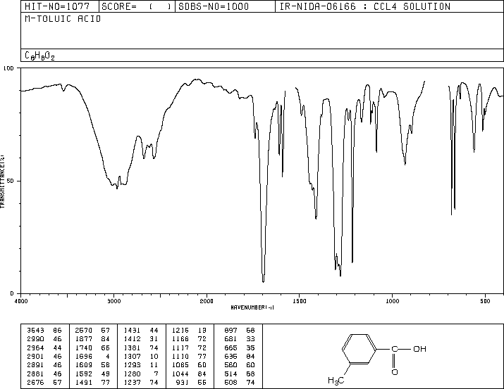
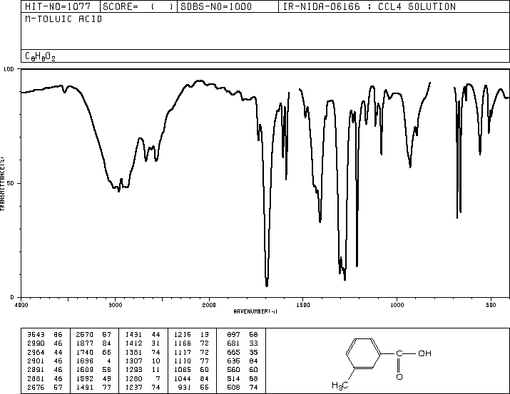

# PixelDilationSpectro

The program uses Pygame to simulate a simple GUI interface that enables the user to trace the bounding box in which the spectrogram can be found.  
Once a bounding box has been delimited, the program inverts the colors and applies thresholding, following a dilation convolution that makes the lines thicker.  

## Before  
    

## After  
  

### To use this program  

Make sure to have cv2, PIL and pygame installed in your standalone version of Python or your Anaconda environment.  
Run the main.py file with the python interpreter.  
Click once to anchor the first corner of the delimiting area, then drag the cursor.  
Click a second time at the position that delimits the bottom right corner of the delimiting box, and let the program run.  
  
Make sure to place your images inside the Dataset folder!

